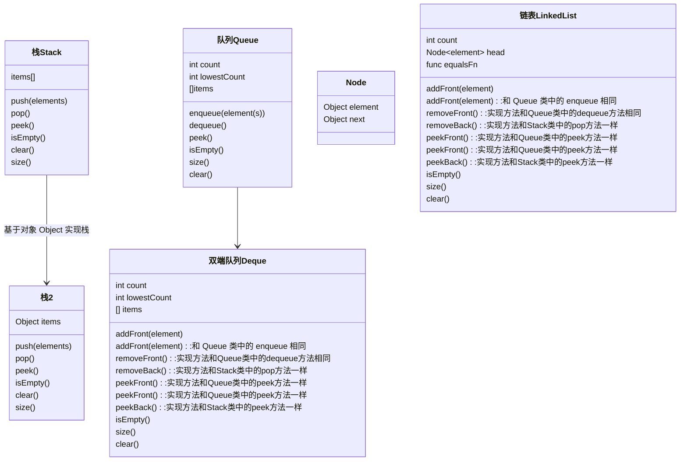

```mermaid
classDiagram
class 栈 Stack {
items[]
push(elements)
pop()
peek()
isEmpty()
clear()
size()
}

class 栈 2 {
Object items
push(elements)
pop()
peek()
isEmpty()
clear()
size()
}
栈 Stack --> 栈 2 : 基于对象 Object 实现栈

class 队列 Queue {
int count
int lowestCount
[]items
enqueue(element(s))
dequeue()
peek()
 isEmpty()
 size()
clear()
}
class 双端队列 Deque {
int count
int lowestCount
[] items
addFront(element)
addFront(element):和 Queue 类中的 enqueue 相同
removeFront():实现方法和Queue类中的dequeue方法相同
removeBack():实现方法和Stack类中的pop方法一样
peekFront():实现方法和Queue类中的peek方法一样
peekFront():实现方法和Queue类中的peek方法一样
peekBack():实现方法和Stack类中的peek方法一样
isEmpty()
size()
clear()
}

队列 Queue --> 双端队列 Deque


class Node {
Object element
Object next
}

class 链表 LinkedList {
int count
Node~element~ head
func equalsFn
addFront(element)
addFront(element):和 Queue 类中的 enqueue 相同
removeFront():实现方法和Queue类中的dequeue方法相同
removeBack():实现方法和Stack类中的pop方法一样
peekFront():实现方法和Queue类中的peek方法一样
peekFront():实现方法和Queue类中的peek方法一样
peekBack():实现方法和Stack类中的peek方法一样
isEmpty()
size()
clear()
}
```