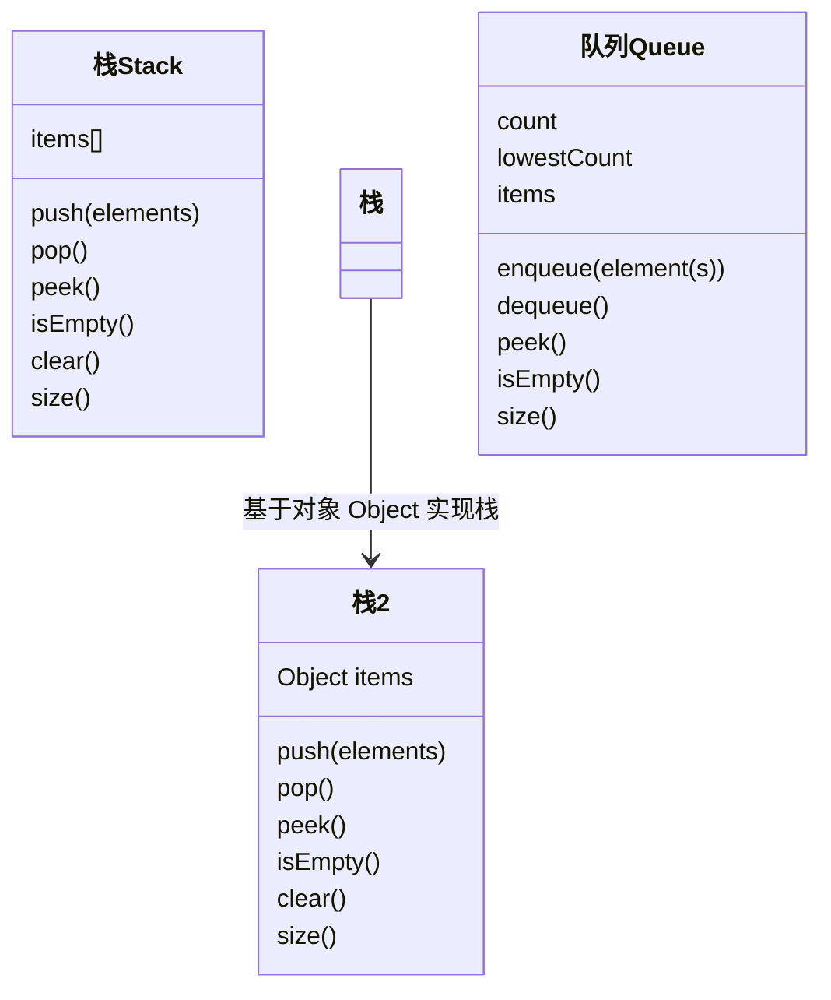

```mermaid
classDiagram
class 栈 Stack {
items[]
push(elements)
pop()
peek()
isEmpty()
clear()
size()
}

class 栈 2 {
Object items
push(elements)
pop()
peek()
isEmpty()
clear()
size()
}
栈 --> 栈 2 : 基于对象 Object 实现栈

class 队列 Queue {
count
lowestCount
items
enqueue(element(s))
dequeue()
peek()
 isEmpty()
 size()
}
```