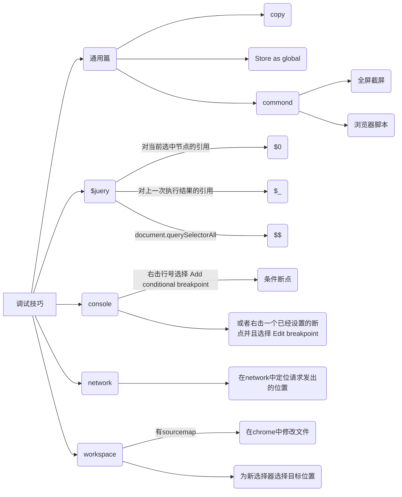

```mermaid
graph LR
A[调试技巧] -->B(通用篇)
A --> C($juery)
A --> D(console)
A --> E(network)
A --> F(workspace)
B --> BA(copy)
B --> BB(Store as global)
B --> BC(commond)
BC --> BCA(全屏截屏)
BC --> BCB(浏览器脚本)
C --> |对当前选中节点的引用|CA($0)
C -->  |对上一次执行结果的引用|CB($_)
C --> |document.querySelectorAll|CC($$)
D -->  |右击行号选择 Add conditional breakpoint|DA(条件断点)
D --> DB(或者右击一个已经设置的断点并且选择 Edit breakpoint)
E --> EA(在network中定位请求发出的位置)
F --> |有sourcemap| FA(在chrome中修改文件)
F --> FB(为新选择器选择目标位置)
```