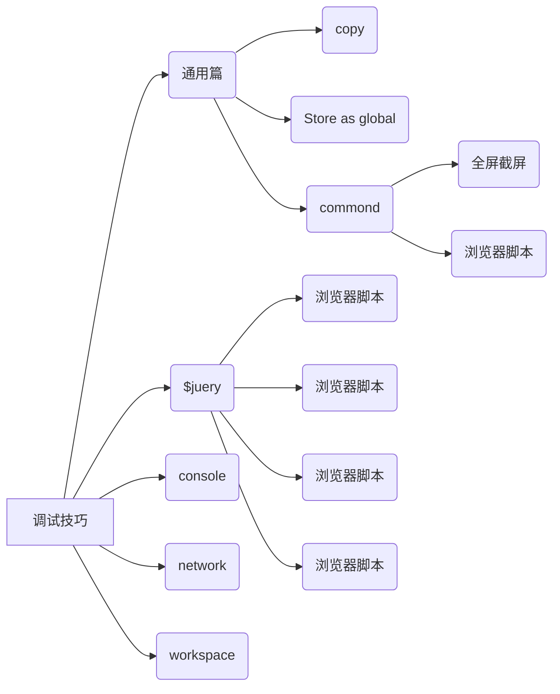

```mermaid
graph LR
A[调试技巧] -->B(通用篇)
A --> C($juery)
A --> D(console)
A --> E(network)
A --> F(workspace)
B --> BA(copy)
B --> BB(Store as global)
B --> BC(commond)
BC --> BCA(全屏截屏)
BC --> BCB(浏览器脚本)
C --> CA(浏览器脚本)
C --> CB(浏览器脚本)
C --> CC(浏览器脚本)
C --> CD(浏览器脚本)
```
